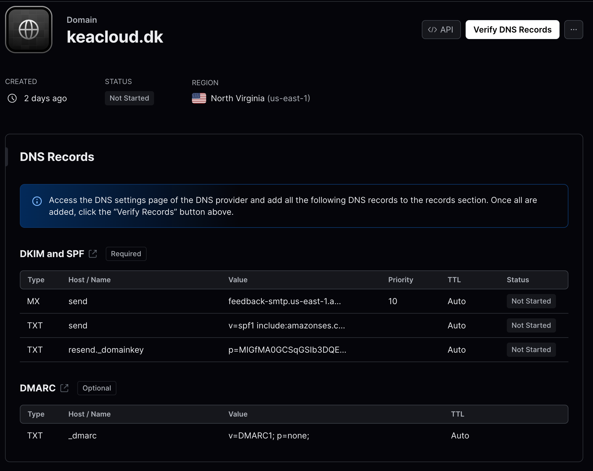
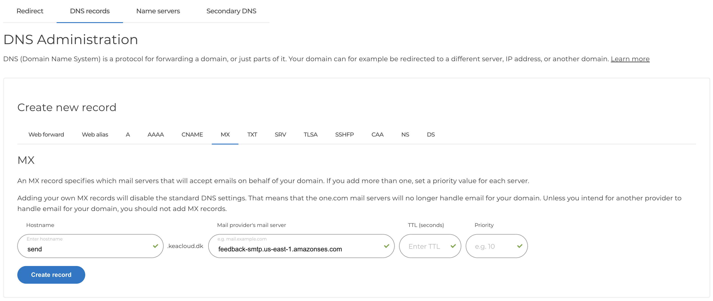
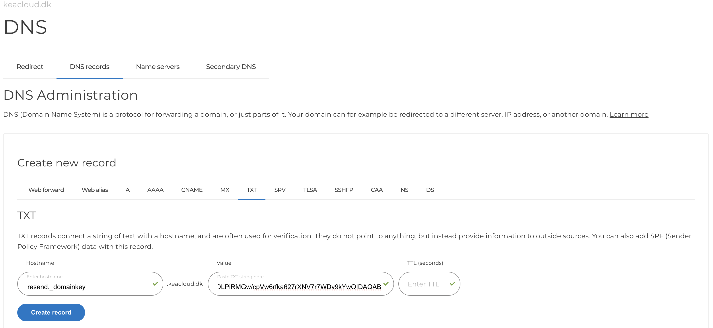
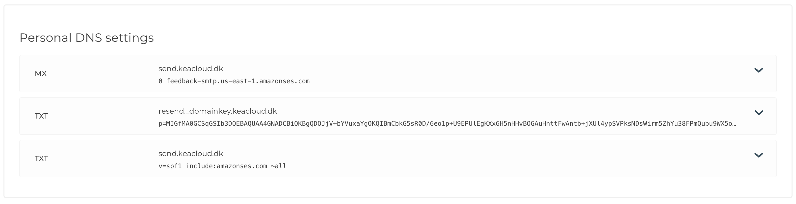
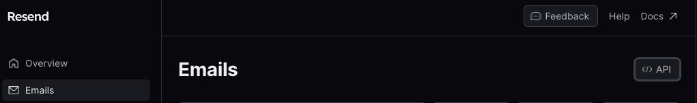
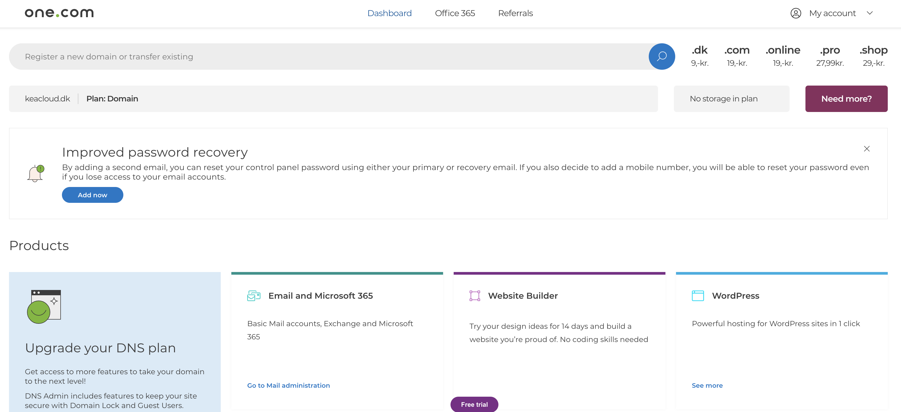
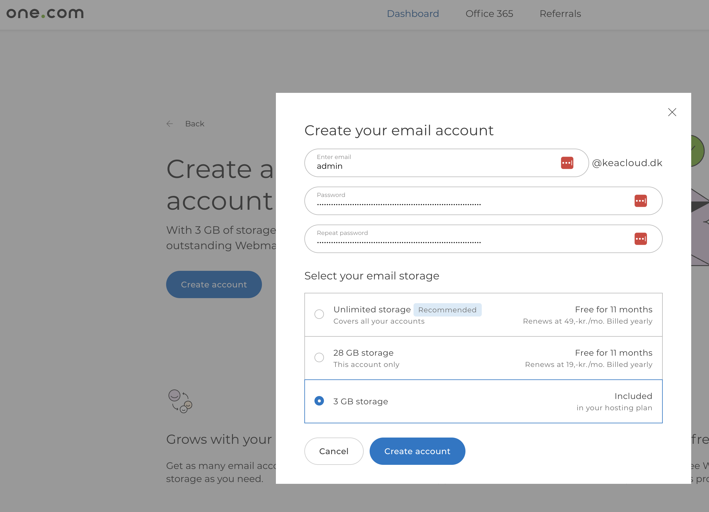

# Prerequisites

This guide is for sending emails through [resend](https://resend.com/) via. your [one.com](https://www.one.com/) domain

You have already registered a domain with one.com. If not, then follow the guide on [Registering domains with one.com](./registering_domain_onecom.md).

You have signed up for a [resend](https://resend.com/) account.

---

# Register your domain in the resend dashboard

Go to [/domains](https://resend.com/domains) and click on "Add domain".

---

# Register the MX value from resend in one.com

---

# Register the TXT value from resend in one.com

Here is one of the two:

---

# Overview of records in one.com

---

# In resend click on "Verify domain" in the top right corner

This will take several hours. 

---

# Verification successful

After some hours:

---

# Send email

After verification. For code help go to [/emails](https://resend.com/emails) and hit on the "</> API" button in the top right. 

Remember to generate an API key and use it. 

Note: We have not setup an email yet, so for the `from` write something like this (replace with your domain): `Admin <noreply@keacloud.dk>`

---

# Additional information

It arrives in my personal inbox (gmail) but for my kea mail (outlook) it goes straight into spam. 

Remember to check there and make sure to trust the domain. 

---

# Setting up an email account in one.com - I

Not possible with the free plan. 

---

# Setting up an email account in one.com - II

Remember that this is not possible with the voucher but it's good to know. 
